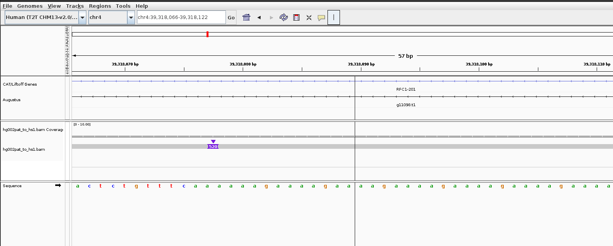

# bedpull

Extract sequences from BAM, PAF, or FASTA files using BED coordinates. A fast, reliable tool for sequence extraction that handles structural variants, insertions, and complex alignments.

## Overview

`bedpull` extracts sequences from alignment files (BAM) or assemblies (FASTA via PAF alignments) based on BED region coordinates. Unlike traditional coordinate lifting tools like liftOver, bedpull uses CIGAR-aware extraction to correctly handle:

- Large insertions and deletions
- Structural variants
- Complex rearrangements
- Phased haplotype assemblies (coming soon!)


## Installation

### From source
```bash
git clone https://github.com/Psy-Fer/bedpull
cd bedpull
cargo build --release
./target/release/bedpull --help
```

Add /<top dir>/bedpull/target/release/ to your `$PATH` for easy use of the `bedpull` binary

### Requirements
- Rust 1.70 or higher
- For BAM extraction: indexed BAM file (.bai)
- For PAF extraction: indexed FASTA file (.fai)

## Usage

### Extract from BAM (aligned reads)
```bash
bedpull --bam alignments.bam \
        --bed regions.bed \
        --output sequences.fasta
```

### Extract from FASTA via PAF alignment
```bash
bedpull --paf assembly_to_reference.paf \
        --query_ref assembly.fasta \
        --bed regions.bed \
        --output sequences.fasta
```

### Options
```
Options:
  -b, --bam <FILE>              Input BAM file (for extracting aligned reads)
      --paf <FILE>              Input PAF file (for assembly-to-reference extraction)
  -q, --query_ref <FILE>        Query FASTA file (required with --paf)
  -r, --bed <FILE>              BED file with regions to extract
  -o, --output <FILE>           Output file (fasta/fastq)
      --fastq                   Output FASTQ format (BAM only)
      --mapq <INT>              Minimum mapping quality [default: 0]
  -h, --help                    Print help
  -V, --version                 Print version
```

## Use Cases

### STR/Tandem Repeat Genotyping
Extract repeat regions from phased assemblies to create ground truth genotypes for benchmarking:

```bash
# Extract STR loci from HG002 paternal haplotype
bedpull --paf hg002pat_to_hs1.paf \
        --query_ref hg002_paternal.fasta \
        --bed clinical_str_sites.bed \
        --output hg002_str_sequences.fasta
```

### Structural Variant Analysis
Correctly extract sequences spanning large insertions or deletions:

Example: RFC1 locus with 520bp insertion



Using liftover to get regions

```
liftOver ./rfc1.bed hg002pat_to_hs1.chain hg002_paternal_regions_rfc1.bed unmapped_pat_rfc1.bed
```


Results:
```
Reference (hs1):               chr4:39318077-39318136 (59 bp)
HG002 paternal (liftover):     chr4_PATERNAL:39438551-39438610 (59bp)
HG002 paternal (bedpull):      chr4_PATERNAL:39438031-39438610 (579 bp)
Insertion captured by bedpull:  520 bp
```

liftover misses the 520bp insertion, but bedpull picks it up

### Phased Assembly Comparison
Extract similar regions from maternal and paternal haplotypes:

```bash
# Maternal haplotype
bedpull --paf hg002mat_to_ref.paf \
        --query_ref hg002_maternal.fasta \
        --bed regions.bed \
        --output maternal_sequences.fasta

# Paternal haplotype  
bedpull --paf hg002pat_to_ref.paf \
        --query_ref hg002_paternal.fasta \
        --bed regions.bed \
        --output paternal_sequences.fasta
```

## How It Works

### BAM Extraction
1. For each BED region, find overlapping alignments
2. Use CIGAR string to calculate exact query positions
3. Extract the aligned portion of the read sequence
4. Handles insertions, deletions, and clipping

### PAF Extraction
1. Builds an index of the PAF file (`*.paf.idx`)
2. For each BED region, query the index for overlapping alignments
3. Use CIGAR string to calculate exact query positions
4. Extract sequence from the query FASTA file using calculated positions
5. Return sequences with both reference and query coordinates in header
6. Write bed file with query coordinates

## Why bedpull?

Traditional coordinate conversion tools (like liftOver) fail when:
- Large insertions exist in one assembly
- Structural rearrangements disrupt alignment impacting chain file generation
- Multiple alignment blocks complicate coordinate mapping

bedpull solves this by:
- parsing CIGAR operations of full alignments to get exact coordinates

## Input Formats

### BED file
Standard 3-column BED format (0-based):
```
chr1    1000    2000
chr2    5000    5500
```

Optional 4th column for region names:
```
chr1    1000    2000    region1
chr4    39318077    39318136    RFC1
```

### BAM file
Must be coordinate-sorted and indexed (.bai file in same directory)

```
samtools view -bS example.sam | samtools sort -o example.bam
samtools index example.bam
```

### PAF file
Standard PAF format from minimap2 or similar aligners. Must include CIGAR string (`cg:Z:` tag).

Example alignment command:

```bash
minimap2 -cx asm5 --cs=long -t 16 reference.fasta query.fasta > alignment.paf
```

### FASTA file
Must be indexed (.fai file). Create index with:
```bash
samtools faidx assembly.fasta
```

## Output

### FASTA headers contain:
**BAM extraction:**
```
>read_name|reference_region|alignment_info
```

**PAF extraction:**
```
>query_name|ref_region:start-end|query_region:start-end
>chr4_PATERNAL|ref_RFC1:39318077-39318136|query_chr4_PATERNAL:39438031-39438610
```

## TODO

- map quality filtering
- fastq mean qscore filtering (for the subqual string)
- secondary and sup alignment handling
- phased haplotype handling
- make a consensus from reads of same region/haplotype
- minimum number of reads to use for consensus building
- reorganisation of some functions to house similar things together (paf and bam are a shambles)
- better handle 4th column in bed file for naming
- rethink header structure, make some standard spec for it across all outputs
- add threading for very large bams/pafs
- add more checks for files, write permissions, arg combination limits (like --fastq only with --bam), etc
- add some example files for people to test/play with


## Citation

If you use bedpull in your research, please cite:
```
GitHub: https://github.com/Psy-Fer/bedpull
```

## License

MIT License - see LICENSE file for details

## Author

James Ferguson (@Psy-Fer)  
Garvan Institute of Medical Research

## Contributing

Issues and pull requests welcome!

## Related Tools

- [bladerunner](https://github.com/Psy-Fer/bladerunner) - STR detection and genotyping
- [samtools](http://www.htslib.org/) - SAM/BAM manipulation
- [bedtools](https://bedtools.readthedocs.io/) - Genome arithmetic
- [minimap2](https://github.com/lh3/minimap2) - Sequence alignment