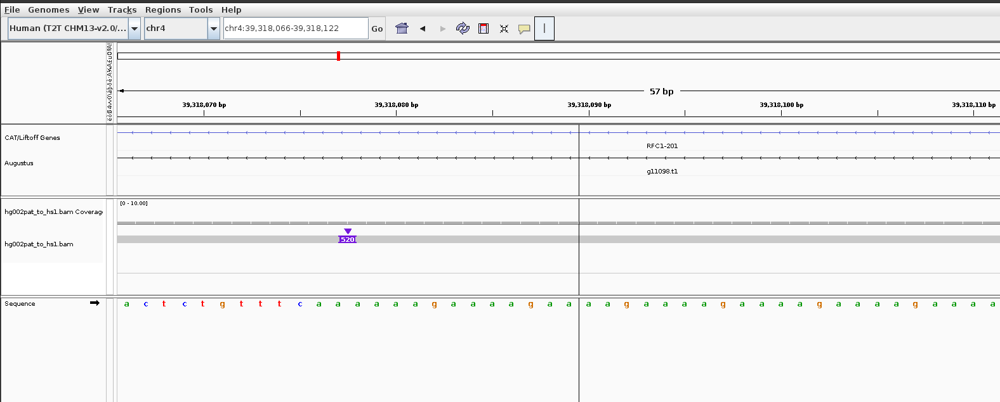

# bedpull

Extract sequences from BAM, PAF, or FASTA files using BED coordinates. A fast, reliable tool for sequence extraction that handles structural variants, insertions, and complex alignments.

## Overview

`bedpull` extracts sequences from alignment files (BAM) or assemblies (FASTA via PAF alignments) based on BED region coordinates. Unlike traditional coordinate lifting tools like liftOver, bedpull uses CIGAR-aware extraction to correctly handle:

- Large insertions and deletions
- Structural variants
- Complex rearrangements
- Phased haplotype assemblies (coming soon!)


## Installation

### Installing Rust if you don't have it yet

```
curl --proto '=https' --tlsv1.2 -sSf https://sh.rustup.rs | sh -s -- -y
source $HOME/.cargo/env
```

### From source
```bash
git clone https://github.com/Psy-Fer/bedpull
cd bedpull
cargo build --release
./target/release/bedpull --help
```

Add `/<top dir>/bedpull/target/release/` to your `$PATH` for easy use of the `bedpull` binary


### building a static binary if you need to run on some other linux system like NCI

```
rustup target add x86_64-unknown-linux-musl
RUSTFLAGS='-C link-arg=-s'
cargo build --release --target x86_64-unknown-linux-musl
./target/x86_64-unknown-linux-musl/release/bedpull --help
```

You can then copy that binary across and use it.

### Requirements
- Rust 1.85 or higher (edition 2024)
- BAM/CRAM files must be coordinate-sorted (bedpull auto-builds a missing `.bai`/`.crai` index)
- FASTA files used with `--reference`/`--query_ref` get a missing `.fai` index auto-built too

## Usage

### Extract from BAM (aligned reads)
```bash
bedpull --bam alignments.bam \
        --bed regions.bed \
        --output sequences.fasta
```

### Extract from FASTA via PAF alignment
```bash
bedpull --paf assembly_to_reference.paf \
        --query_ref assembly.fasta \
        --bed regions.bed \
        --output sequences.fasta
```

### Options
```
Options:
  -b, --bam <FILE>              Input BAM file (for extracting aligned reads)
      --paf <FILE>              Input PAF file (for assembly-to-reference extraction)
  -q, --query_ref <FILE>        Query FASTA file (required with --paf)
  -r, --bed <FILE>              BED file with regions to extract
  -o, --output <FILE>           Output file (fasta/fastq)
      --fastq                   Output FASTQ format (BAM only)
      --mapq <INT>              Minimum mapping quality [default: 0]
      --unmapped <FILE>         Write input regions that produced no output here, with reasons
      --debug                   Print verbose per-region/per-read diagnostic output
  -h, --help                    Print help
  -V, --version                 Print version
```

## Use Cases

### STR/Tandem Repeat Genotyping
Extract repeat regions from phased assemblies to create ground truth genotypes for benchmarking:

```bash
# Extract STR loci from HG002 paternal haplotype
bedpull --paf hg002pat_to_hs1.paf \
        --query_ref hg002_paternal.fasta \
        --bed clinical_str_sites.bed \
        --output hg002_str_sequences.fasta
```

### Structural Variant Analysis
Correctly extract sequences spanning large insertions or deletions:

Example: RFC1 locus with 520bp insertion



Using liftover to get regions

```
liftOver ./rfc1.bed hg002pat_to_hs1.chain hg002_paternal_regions_rfc1.bed unmapped_pat_rfc1.bed
```


Results:
```
Reference (hs1):               chr4:39318077-39318136 (59 bp)
HG002 paternal (liftover):     chr4_PATERNAL:39438551-39438610 (59bp)
HG002 paternal (bedpull):      chr4_PATERNAL:39438031-39438610 (579 bp)
Insertion captured by bedpull:  520 bp
```

liftover misses the 520bp insertion, but bedpull picks it up

### Phased Assembly Comparison
Extract similar regions from maternal and paternal haplotypes:

```bash
# Maternal haplotype
bedpull --paf hg002mat_to_ref.paf \
        --query_ref hg002_maternal.fasta \
        --bed regions.bed \
        --output maternal_sequences.fasta

# Paternal haplotype  
bedpull --paf hg002pat_to_ref.paf \
        --query_ref hg002_paternal.fasta \
        --bed regions.bed \
        --output paternal_sequences.fasta
```

### Per-Haplotype Consensus Building
`bedpull` doesn't build consensus sequences itself — for that, pair it with
[poa-consensus](https://github.com/Psy-Fer/poa-consensus), a banded partial-order
alignment tool built for exactly this. Use `--hap_split` to bin reads from a
BAM's `HP` tag (or a PAF's `hp:i:` tag) into one FASTA per haplotype, then run
`poa-consensus` on each file to get a per-haplotype consensus. Use a single-region
BED (or one BED file per locus) so each haplotype FASTA holds reads from only
that region — `poa-consensus` builds one consensus per input file.

```bash
# 1. Extract reads for one region, split by haplotype
bedpull --bam alignments.bam \
        --bed rfc1.bed \
        --hap_split \
        --output rfc1_reads.fasta
# -> rfc1_reads.h0.fasta (unphased), rfc1_reads.h1.fasta, rfc1_reads.h2.fasta

# 2. Install poa-consensus (one-time)
cargo install poa-consensus --features cli

# 3. Build a consensus for each phased haplotype
poa-consensus rfc1_reads.h1.fasta > rfc1_h1_consensus.fasta
poa-consensus rfc1_reads.h2.fasta > rfc1_h2_consensus.fasta
```

## How It Works

### BAM Extraction
1. For each BED region, find overlapping alignments
2. Use CIGAR string to calculate exact query positions
3. Extract the aligned portion of the read sequence
4. Handles insertions, deletions, and clipping

### PAF Extraction
1. Builds an index of the PAF file (`*.paf.idx`)
2. For each BED region, query the index for overlapping alignments
3. Use CIGAR string to calculate exact query positions
4. Extract sequence from the query FASTA file using calculated positions
5. Return sequences with both reference and query coordinates in header
6. Write bed file with query coordinates

## Why bedpull?

Traditional coordinate conversion tools (like liftOver) fail when:
- Large insertions exist in one assembly
- Structural rearrangements disrupt alignment impacting chain file generation
- Multiple alignment blocks complicate coordinate mapping

bedpull solves this by:
- parsing CIGAR operations of full alignments to get exact coordinates
- reporting which input regions produced no output and why, via `--unmapped <file>` — similar to liftOver's own `-unmapped` file, but across BAM/CRAM/PAF modes

## Input Formats

### BED file
Standard 3-column BED format (0-based):
```
chr1    1000    2000
chr2    5000    5500
```

Optional 4th column for region names:
```
chr1    1000    2000    region1
chr4    39318077    39318136    RFC1
```

### BAM file
Must be coordinate-sorted. If the `.bai` index is missing, bedpull builds it
automatically the first time you run it against that file:

```
samtools view -bS example.sam | samtools sort -o example.bam
bedpull --bam example.bam --bed regions.bed --output out.fasta
```

### PAF file
Standard PAF format from minimap2 or similar aligners. Must include CIGAR string (`cg:Z:` tag).

Example alignment command:

```bash
minimap2 -cx asm5 --cs=long -t 16 reference.fasta query.fasta > alignment.paf
```

### FASTA file
If the `.fai` index is missing, bedpull builds it automatically the first time
you run it against that file (equivalent to `samtools faidx assembly.fasta`).

## Output

### FASTA headers contain:
**BAM extraction:**
```
>read_name|reference_region|alignment_info
```

With `--partial`, a read that doesn't fully span the requested region gets an extra
`missing_left=Nbp` and/or `missing_right=Nbp` suffix showing how many reference bases
of the region (or `--flanks` window) fall outside the read's alignment:
```
>read1|chr4:39260000-39380000|RFC1|missing_left=3480bp|missing_right=55332bp
```

Use `--min_partial_coverage <0.0-1.0>` alongside `--partial` to drop reads that cover less than
that fraction of the requested window, instead of accepting any overlap however small (similar
to liftOver's `-minMatch`):
```bash
bedpull --bam reads.bam --bed regions.bed --output out.fasta --partial --min_partial_coverage 0.9
```

**PAF extraction:**
```
>query_name|chr:ref_start-ref_end|bed_name|query_name:query_start-query_end|strand
>chr4_PATERNAL|chr4:39318077-39318136|RFC1|chr4_PATERNAL:39438031-39438610|+
```

## TODO

- add threading for very large bams/pafs


## Citation

If you use bedpull in your research, please cite:
```
GitHub: https://github.com/Psy-Fer/bedpull
```

## License

MIT License - see LICENSE file for details

## Author

James Ferguson (@Psy-Fer)  
Garvan Institute of Medical Research

## Contributing

Issues and pull requests welcome!

## Related Tools

- [bladerunner](https://github.com/Psy-Fer/bladerunner) - STR detection and genotyping
- [poa-consensus](https://github.com/Psy-Fer/poa-consensus) - Build consensus sequences from reads extracted by bedpull
- [samtools](http://www.htslib.org/) - SAM/BAM manipulation
- [bedtools](https://bedtools.readthedocs.io/) - Genome arithmetic
- [minimap2](https://github.com/lh3/minimap2) - Sequence alignment